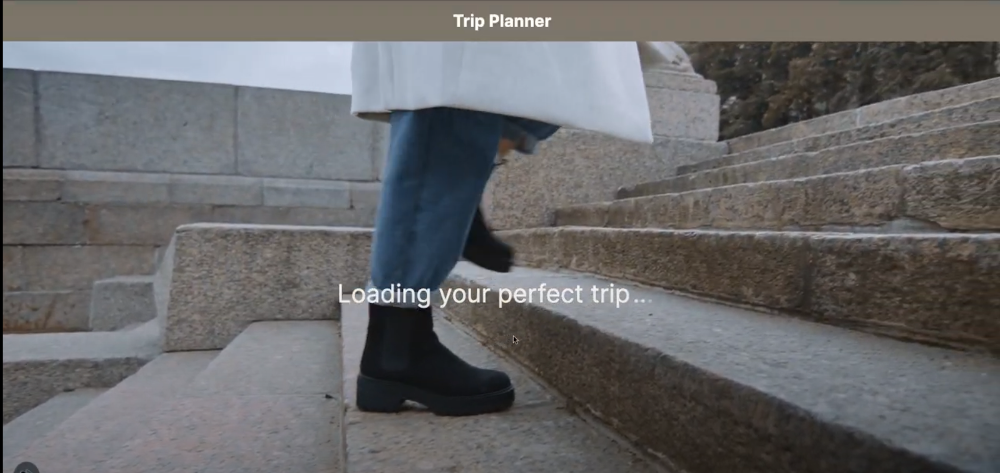
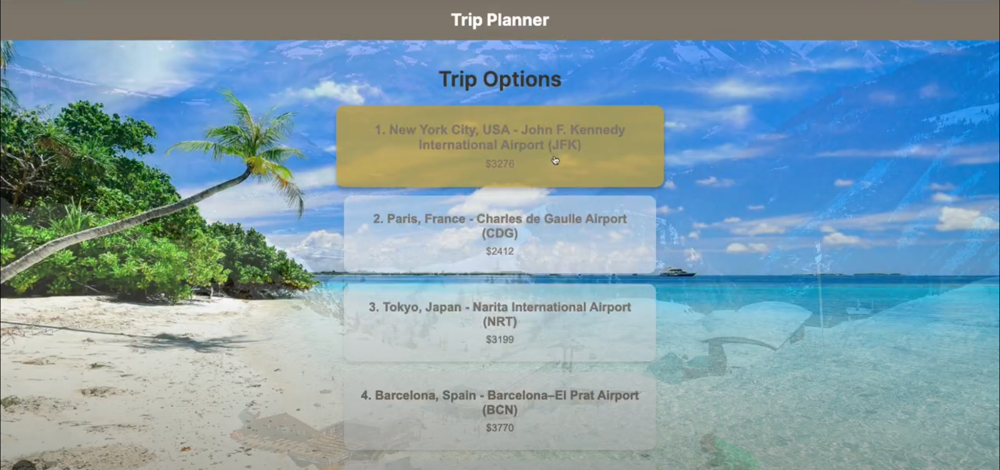
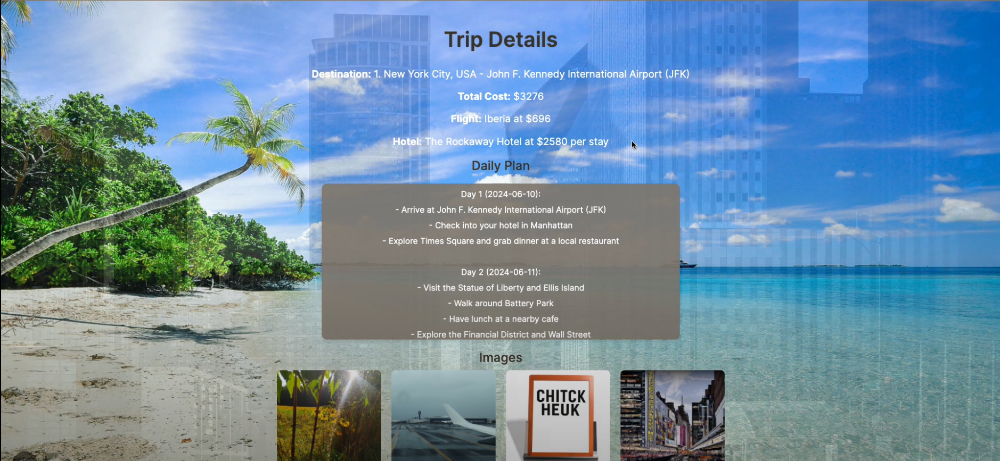

# Trip Planner App

Welcome to the Trip Planner App project! This application helps users plan trips by suggesting destinations, finding flights and hotels, and creating a daily itinerary.

## Project Overview

This project comprises two main components:

1. **Trip Planner API**: A Python-based backend that interacts with the OpenAI API, SerpApi for Google Flights and Hotels, and creates detailed trip plans.
2. **Trip Planner App**: A Next.js-based frontend that lets users enter trip details and view suggested destinations, flights, hotels, and a daily itinerary.

## Features

- **Destination Suggestions**: Get 5 possible travel destinations based on trip type and dates.
- **Flight and Hotel Search**: Find the cheapest flights and the best hotels within the user's budget.
- **Daily Itinerary**: Create a detailed daily plan for the chosen destination.
- **Visual Trip Preview**: Generate images depicting the planned trip activities.

## Screenshots

### Welcome Page


### Search Page


### Loading Page


### Trip Options


### Trip Details


## Getting Started

Follow these steps to run the project locally.

### Prerequisites

- Node.js
- Python 3.7+
- npm (Node Package Manager)
- pip (Python Package Installer)

### Installation

1. **Clone the Repository**

   ```sh
   git clone https://github.com/yourusername/trip-planner-app.git
   cd Trip-Planner
   ### Installation

2. **Set up the backend**

stay in the same repository:

Install Python dependencies:
pip install -r requirements.txt

Run the FastAPI server:
uvicorn main:app --reload

3. **Set up the frontend**

Open a new terminal and navigate to the trip-planner directory:
cd trip-planner

Install Node.js dependencies:
npm install

Run the Next.js development server:
npm run dev

4. **Access the Application**

Open your web browser and navigate to http://localhost:3000.

### Usage
Enter the start date, end date, budget, and trip type in the search form and click "Search".
View the suggested destinations with total prices (flight + hotel) and select one.
Review the daily itinerary and generated images for the chosen destination.


## Project Structure

```plaintext
trip-planner-app/
│
│   ├── main.py
│   ├── models.py
│   ├── api_client.py
│   ├── trip_planner.py
│   └── ...
│
├── trip-planner/
│   ├── pages/
│   │   ├── index.js
│   │   └── ...
│   ├── package.json
│   └── ...
│
└── README.md

```

### Contributing
Contributions are welcome! Please follow these steps to contribute:

Fork the repository.

Create a new branch for your feature or bugfix.

Commit your changes with clear and descriptive messages.

Push your changes to your forked repository.

Create a pull request to the main repository.

### Author
Tomer Menashe

